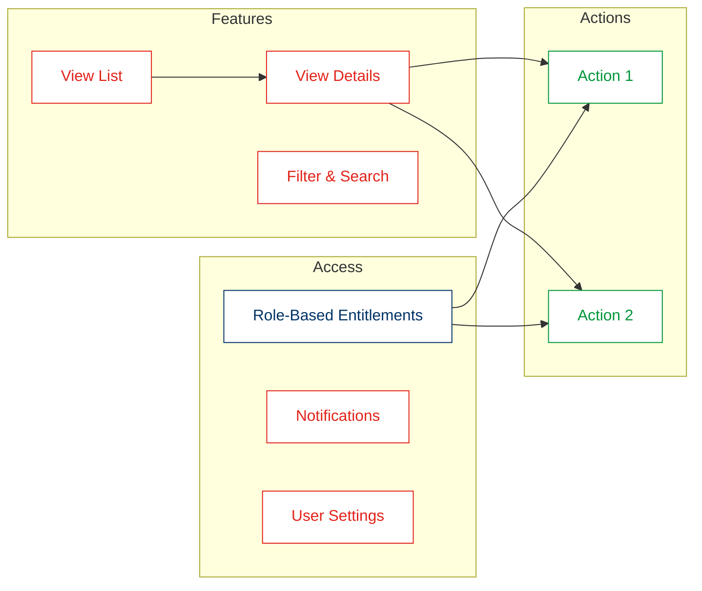
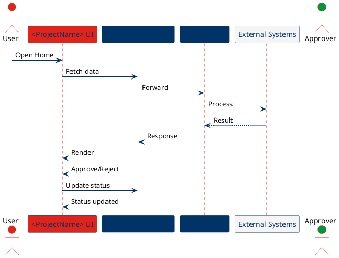

# Screen & Feature Map — How to Recreate From Project Name Only

## Purpose
- Quickly generate a diagram-ready Markdown map for any Galaxy microfrontend by providing just the project name.

## Inputs
- Project Name: e.g., `accountpac`, `accountworkflow`, `payment`, `entitlements`.

## Output
- A Markdown file saved inside the project folder: `galaxy-<projectName>-microfrontend/<fileName>.md`.
- Recommended filename pattern: `galaxy-<projectName>-screen-feature-map-YYYY-mon.md` (e.g., `galaxy-accountworkflow-screen-feature-map-2026-feb.md`).

## Required Sections
- Overview
- Legend
- Mermaid (flowchart) for screens/navigation
- Mermaid (feature map)
- PlantUML (sequence or flow map)
- Notes
- References (link to component.yaml and openapi.yaml)
- Maintenance

## Styling (Westpac Palette)
- UI: Red (#E2231A)
- APIs/Gateways: Blue (#003366)
- Maker-Checker/Approvals: Green (#009639)
- External/Downstream: Grey (#F5F5F5)

## File Metadata
Add a frontmatter block at the top:

```markdown
---
Title: Galaxy <ProjectName> Microfrontend — Screen & Feature Map
Description: Diagram-ready mapping of screens, features, and flows for Galaxy <ProjectName>.
Author: GitHub Copilot
Last Updated: 2026-02-11
---
```

## Drop-in Template (Copy, Replace <ProjectName>)

```markdown
---
Title: Galaxy <ProjectName> Microfrontend — Screen & Feature Map
Description: Diagram-ready mapping of screens, features, and flows for Galaxy <ProjectName>.
Author: GitHub Copilot
Last Updated: 2026-02-11
---

## Overview
- Purpose: Visualize key screens and flows for <ProjectName>.
- Scope: UI screens, core actions, and integrations.
- Audience: Designers, engineers, testers, stakeholders.

## Legend
- Red: UI screens
- Blue: APIs/gateways/backends
- Green: Approvals/Maker-Checker actions
- Grey: External/downstream systems

## Mermaid (flowchart)
```mermaid
graph TD
  %% Legend classes
  classDef action fill:#FCE7F3,stroke:#DB2777,stroke-width:2,color:#0B1220;
  classDef status fill:#E8F1FF,stroke:#2563EB,stroke-width:2,color:#0B1220;
  classDef external fill:#F3F4F6,stroke:#6B7280,stroke-width:1.5,color:#111827;
  classDef note fill:#FFF7ED,stroke:#F59E0B,stroke-width:1.5,color:#111827;

  SPA[Staff Portal / Shell SPA\n(OpenFin Desktop or Web)]:::external

  subgraph MFE[Galaxy <ProjectName> Microfrontend (Base Route: /<projectName>/*)]
    Home[Home]:::action
    ScreenA[Screen A]:::action
    ScreenB[Screen B]:::action
    StatusX[Status/Submission]:::status
    Error[Error / Not Found]:::status
  end

  NOTE0[Entitlements (high-level)\nRoutes mapped to resources + actions]:::note

  SPA --> Home
  Home --> ScreenA
  Home --> ScreenB
  ScreenA --> StatusX
  ScreenB --> StatusX
  SPA --- NOTE0
```

## Mermaid (feature map)


## PlantUML (sequence/flow)


## Notes
- Use PascalCase for screen/component names where applicable.
- Keep diagrams small, readable, and single-purpose.
- Align with Westpac palette for clarity and consistency.

## References
- Component definition: galaxy-<projectName>-microfrontend/component.yaml
- Contract (OpenAPI): galaxy-<projectName>-microfrontend/openapi.yaml

## Save Location
- Save the file at: `galaxy-<projectName>-microfrontend/galaxy-<projectName>-screen-feature-map-YYYY-mon.md`.

## Optional (Separate Sources)
- Create `docs/diagrams/` under the project and add dedicated `.mmd` and `.puml` sources with a companion `.md` file.

## One-Line Prompt (Copy/Paste)
- "Create a Galaxy <ProjectName> Microfrontend — Screen & Feature Map (Diagram-Ready) and save it as galaxy-<projectName>-screen-feature-map-YYYY-mon.md inside the galaxy-<projectName>-microfrontend folder. Use Mermaid for a Screen Map and Feature Map, plus a PlantUML sequence. Follow Westpac palette (red UI, blue APIs, green maker-checker), include Overview, Legend, Notes, References to component.yaml and openapi.yaml, and set Last Updated to 2026-02-11."
